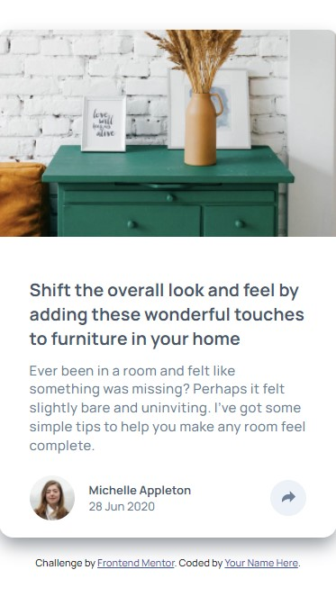
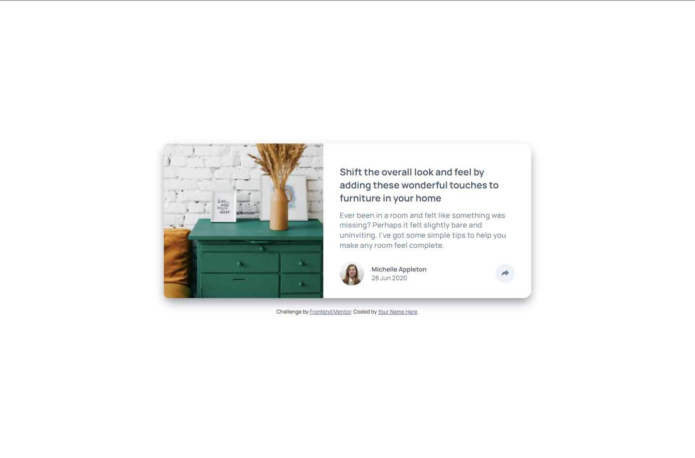

# Frontend Mentor - Article preview component solution

This is a solution to the [Article preview component challenge on Frontend Mentor](https://www.frontendmentor.io/challenges/article-preview-component-dYBN_pYFT). Frontend Mentor challenges help you improve your coding skills by building realistic projects.

## Table of contents

- [Overview](#overview)
  - [The challenge](#the-challenge)
  - [Screenshot](#screenshot)
  - [Links](#links)
- [My process](#my-process)
  - [Built with](#built-with)
  - [What I learned](#what-i-learned)
  - [Continued development](#continued-development)
  - [Useful resources](#useful-resources)
- [Author](#author)
- [Acknowledgments](#acknowledgments)

## Overview

### The challenge

Users should be able to:

- View the optimal layout for the component depending on their device's screen size
- See the social media share links when they click the share icon

### Screenshot

### Links

- Solution URL: [Add solution URL here](https://your-solution-url.com)
- Live Site URL: [Add live site URL here](https://your-live-site-url.com)

### Built with

- Semantic HTML5 markup
- Scss custom properties
- Flexbox
- Mobile-first workflow
- JavaScript ResizeObserver

### Useful resources

- [after element shadow](https://stackoverflow.com/questions/47993024/css3-box-shadow-on-pseudo-before-and-after-elements) - This helped me for set shadow on after element. I really liked this pattern and will use it going forward.

## Author

- Frontend Mentor - [@yKrzysiekLu](https://www.frontendmentor.io/profile/KrzysiekLu)
